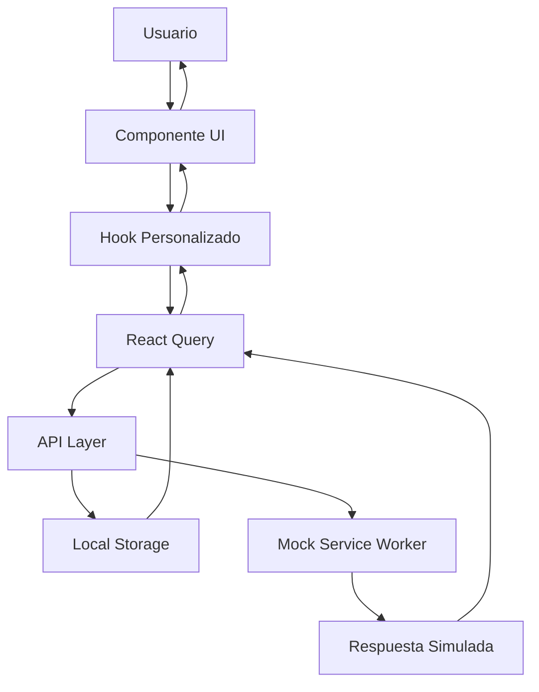

# SOLUTION TECH - Chat Empresarial Inteligente

<div align="center">
  
  <h1>💬 SOLUTION TECH</h1>
  <p><strong>Chat Empresarial Inteligente</strong> - Tu asistente virtual para consultas empresariales</p>
  
  [](https://nextjs.org/)
  [](https://www.typescriptlang.org/)
  [](https://tailwindcss.com/)
  [](https://tanstack.com/query)
</div>

## 📋 Tabla de Contenidos

- [🎯 Características](#-características)
- [🚀 Instalación](#-instalación)
- [📖 Uso](#-uso)
- [🏗️ Arquitectura](#️-arquitectura)
- [🔧 Configuración](#-configuración)
- [📁 Estructura del Proyecto](#-estructura-del-proyecto)
- [🎨 Componentes](#-componentes)
- [🛠️ Desarrollo](#️-desarrollo)
- [🧪 Testing](#-testing)
- [📦 Despliegue](#-despliegue)
- [🤝 Contribución](#-contribución)
- [📄 Licencia](#-licencia)

## 🎯 Características

### ✨ Funcionalidades Principales
- **💬 Chat Inteligente**: Conversaciones fluidas con IA para consultas empresariales
- **📚 Preguntas Sugeridas**: Categorías organizadas de preguntas predeterminadas
- **📁 Gestión de Archivos**: Soporte para adjuntar documentos e imágenes
- **🔍 Búsqueda Avanzada**: Búsqueda en el historial de conversaciones
- **💾 Persistencia Local**: Almacenamiento local de conversaciones
- **📱 Diseño Responsivo**: Interfaz optimizada para móviles y escritorio
- **🎨 Tema Adaptativo**: Soporte para modo claro y oscuro
- **⚡ Rendimiento Optimizado**: Carga rápida y navegación fluida

### 🎨 Experiencia de Usuario
- **Interfaz Intuitiva**: Diseño limpio y fácil de usar
- **Navegación Fluida**: Transiciones suaves entre pantallas
- **Feedback Visual**: Estados de carga y confirmaciones claras
- **Accesibilidad**: Cumple con estándares de accesibilidad web
- **Teclado Rápido**: Atajos de teclado para usuarios avanzados

## 🚀 Instalación

### Prerrequisitos
- **Node.js** 18.0 o superior
- **pnpm** (recomendado) o npm
- **Git**

### Pasos de Instalación

1. **Clonar el repositorio**
   ```bash
   git clone https://github.com/tu-usuario/solution-tech-chat-app.git
   cd solution-tech-chat-app
   ```

2. **Instalar dependencias**
   ```bash
   pnpm install
   # o
   npm install
   ```

3. **Configurar variables de entorno**
   ```bash
   cp .env.example .env.local
   ```
   
   Editar `.env.local`:
   ```env
   NEXT_PUBLIC_APP_NAME=SOLUTION TECH
   NEXT_PUBLIC_API_BASE_URL=/api
   NEXT_PUBLIC_MSW_ENABLED=true
   ```

4. **Ejecutar en desarrollo**
   ```bash
   pnpm dev
   # o
   npm run dev
   ```

5. **Abrir en el navegador**
   ```
   http://localhost:3000
   ```

### 🐳 Docker (Opcional)

```bash
# Construir imagen
docker build -t solution-tech-chat .

# Ejecutar contenedor
docker run -p 3000:3000 solution-tech-chat
```

## 📖 Uso

### 🎯 Iniciar una Conversación

1. **Página Principal**: Al acceder a la aplicación, verás la pantalla de bienvenida
2. **Preguntas Sugeridas**: Explora las categorías de preguntas predeterminadas:
   - 📈 **Estrategia Empresarial**: Planificación y crecimiento
   - 🎯 **Marketing y Ventas**: Estrategias de marketing digital
   - ⚙️ **Operaciones**: Optimización de procesos
   - 💻 **Transformación Digital**: Tecnologías emergentes
   - 🔒 **Ciberseguridad**: Protección de datos
   - 💰 **Finanzas**: Gestión financiera
   - 👥 **Liderazgo**: Gestión de equipos
   - 💡 **Innovación**: Desarrollo de productos

3. **Pregunta Personalizada**: Escribe tu propia consulta en el área de texto
4. **Enviar**: Presiona Enter o haz clic en "Iniciar conversación"

### 💬 Durante la Conversación

- **Enviar Mensajes**: Escribe y presiona Enter
- **Adjuntar Archivos**: Usa el botón de adjuntar para documentos
- **Nueva Línea**: Shift + Enter para saltos de línea
- **Navegación**: Usa el historial lateral para cambiar de conversación

### 🔍 Búsqueda y Gestión

- **Buscar Conversaciones**: Usa la barra de búsqueda en el historial
- **Eliminar Chat**: Botón de eliminar en cada conversación
- **Nueva Conversación**: Botón "+" para iniciar un nuevo chat

### ⌨️ Atajos de Teclado

| Acción | Windows/Linux | Mac |
|--------|---------------|-----|
| Enviar mensaje | Enter | Enter |
| Nueva línea | Shift + Enter | Shift + Enter |
| Nueva conversación | Ctrl + N | Cmd + N |
| Buscar | Ctrl + K | Cmd + K |
| Navegar historial | ↑/↓ | ↑/↓ |

## 🏗️ Arquitectura

### 🎯 Patrón de Diseño
La aplicación sigue el patrón **Component-Based Architecture** con separación clara de responsabilidades:

```
┌─────────────────┐    ┌─────────────────┐    ┌─────────────────┐
│   Presentation  │    │    Business     │    │      Data       │
│     Layer       │    │     Logic       │    │     Layer       │
│                 │    │                 │    │                 │
│  - Components   │◄──►│   - Hooks       │◄──►│  - API Calls    │
│  - Pages        │    │   - Contexts    │    │  - Storage      │
│  - UI Elements  │    │   - Utils       │    │  - Validation   │
└─────────────────┘    └─────────────────┘    └─────────────────┘
```

### 🔧 Tecnologías Principales

| Tecnología | Versión | Propósito |
|------------|---------|-----------|
| **Next.js** | 14 | Framework React con SSR/SSG |
| **TypeScript** | 5.0 | Tipado estático |
| **Tailwind CSS** | 3.3 | Framework CSS utility-first |
| **React Query** | 5.0 | Gestión de estado del servidor |
| **MSW** | 2.0 | Mocking de API para desarrollo |
| **Lucide React** | 0.263 | Iconografía |
| **Zod** | 3.22 | Validación de esquemas |

### 📊 Flujo de Datos



## 🔧 Configuración

### Variables de Entorno

```env
# Configuración de la aplicación
NEXT_PUBLIC_APP_NAME=SOLUTION TECH
NEXT_PUBLIC_API_BASE_URL=/api
NEXT_PUBLIC_MSW_ENABLED=true

# Configuración de desarrollo
NODE_ENV=development
```

### Configuración de MSW (Mock Service Worker)

Para desarrollo sin backend real:

```javascript
// scripts/init-msw.js
const { execSync } = require('child_process');

try {
  execSync('npx msw init public/ --save', { stdio: 'inherit' });
  console.log('✅ MSW inicializado correctamente');
} catch (error) {
  console.error('❌ Error inicializando MSW:', error);
}
```

## 📁 Estructura del Proyecto

```
solution-tech-chat-app/
├── 📁 public/                 # Archivos estáticos
│   ├── favicon.ico
│   ├── mockServiceWorker.js   # MSW worker
│   └── *.svg                  # Iconos
├── 📁 src/
│   ├── 📁 app/               # App Router (Next.js 14)
│   │   ├── 📁 api/           # API Routes
│   │   ├── 📁 chat/          # Páginas de chat
│   │   ├── globals.css       # Estilos globales
│   │   ├── layout.tsx        # Layout principal
│   │   └── page.tsx          # Página principal
│   ├── 📁 components/        # Componentes React
│   │   ├── 📁 chat/          # Componentes de chat
│   │   ├── 📁 common/        # Componentes comunes
│   │   ├── 📁 layout/        # Componentes de layout
│   │   └── 📁 ui/            # Componentes UI base
│   ├── 📁 contexts/          # Contextos React
│   ├── 📁 hooks/             # Hooks personalizados
│   ├── 📁 lib/               # Utilidades y configuraciones
│   ├── 📁 mocks/             # Mocks para desarrollo
│   ├── 📁 types/             # Definiciones de tipos
│   └── 📁 utils/             # Funciones utilitarias
├── 📄 package.json           # Dependencias y scripts
├── 📄 tailwind.config.ts     # Configuración de Tailwind
├── 📄 tsconfig.json          # Configuración de TypeScript
└── 📄 README.md              # Este archivo
```

## 🎨 Componentes

### 🏗️ Arquitectura de Componentes

```
Components/
├── 📁 chat/                  # Componentes específicos del chat
│   ├── ChatInterface.tsx     # Interfaz principal del chat
│   ├── ChatHistory.tsx       # Historial de conversaciones
│   ├── MessageList.tsx       # Lista de mensajes
│   ├── MessageInput.tsx      # Input para mensajes
│   ├── NewChat.tsx           # Crear nueva conversación
│   ├── SuggestedQuestions.tsx # Preguntas sugeridas
│   └── FileAttachment.tsx    # Adjuntar archivos
├── 📁 common/                # Componentes reutilizables
│   ├── LoadingSpinner.tsx    # Indicadores de carga
│   ├── ErrorBoundary.tsx     # Manejo de errores
│   ├── EmptyState.tsx        # Estados vacíos
│   └── ErrorNotifications.tsx # Notificaciones de error
├── 📁 layout/                # Componentes de estructura
│   └── Layout.tsx            # Layout principal
└── 📁 ui/                    # Componentes base de UI
    ├── button.tsx            # Botones
    ├── card.tsx              # Tarjetas
    ├── input.tsx             # Inputs
    └── dialog.tsx            # Diálogos
```

### 🎯 Principios de Diseño

1. **Composición**: Componentes pequeños y reutilizables
2. **Props Interface**: Tipado estricto de props
3. **Error Boundaries**: Manejo robusto de errores
4. **Loading States**: Estados de carga consistentes
5. **Accessibility**: Soporte para lectores de pantalla

## 🛠️ Desarrollo

### Scripts Disponibles

```bash
# Desarrollo
pnpm dev              # Servidor de desarrollo
pnpm build            # Construir para producción
pnpm start            # Servidor de producción
pnpm lint             # Linting con ESLint
pnpm type-check       # Verificación de tipos

# Utilidades
pnpm msw:init         # Inicializar MSW
pnpm msw:test         # Probar MSW
pnpm clear-storage    # Limpiar almacenamiento local
```

### 🔍 Debugging

1. **React DevTools**: Instalar extensión del navegador
2. **Network Tab**: Monitorear llamadas a API
3. **Console**: Logs detallados en desarrollo
4. **Local Storage**: Inspeccionar datos almacenados

### 📝 Convenciones de Código

#### Nomenclatura
```typescript
// Componentes: PascalCase
export function ChatInterface() {}

// Hooks: camelCase con prefijo 'use'
export function useChat() {}

// Tipos: PascalCase
interface ChatMessage {}

// Constantes: UPPER_SNAKE_CASE
export const API_ENDPOINTS = {}
```

#### Estructura de Archivos
```typescript
// 1. Imports externos
import React from 'react';

// 2. Imports internos
import { Button } from '@/components/ui/button';

// 3. Tipos e interfaces
interface ComponentProps {}

// 4. Constantes
const CONSTANTS = {};

// 5. Componente principal
export function Component() {}

// 6. Hooks personalizados
function useCustomHook() {}
```

## 🧪 Testing

### Configuración de Tests

```bash
# Instalar dependencias de testing
pnpm add -D @testing-library/react @testing-library/jest-dom jest

# Ejecutar tests
pnpm test
```

### Tipos de Tests

1. **Unit Tests**: Componentes individuales
2. **Integration Tests**: Flujos de usuario
3. **E2E Tests**: Casos de uso completos

### Ejemplo de Test

```typescript
import { render, screen } from '@testing-library/react';
import { NewChat } from '@/components/chat/NewChat';

describe('NewChat', () => {
  it('should render welcome message', () => {
    render(<NewChat onChatCreated={jest.fn()} />);
    expect(screen.getByText('Bienvenido a SOLUTION TECH')).toBeInTheDocument();
  });
});
```

## 📦 Despliegue

### Vercel (Recomendado)

1. **Conectar repositorio** en Vercel
2. **Configurar variables de entorno**
3. **Deploy automático** en cada push

### Docker

```bash
# Construir imagen
docker build -t solution-tech-chat .

# Ejecutar en producción
docker run -p 3000:3000 -e NODE_ENV=production solution-tech-chat
```

### Variables de Producción

```env
NODE_ENV=production
NEXT_PUBLIC_APP_NAME=SOLUTION TECH
NEXT_PUBLIC_API_BASE_URL=https://api.tudominio.com
NEXT_PUBLIC_MSW_ENABLED=false
```

## 🤝 Contribución

### 🎯 Cómo Contribuir

1. **Fork** el repositorio
2. **Crear** una rama para tu feature (`git checkout -b feature/AmazingFeature`)
3. **Commit** tus cambios (`git commit -m 'Add some AmazingFeature'`)
4. **Push** a la rama (`git push origin feature/AmazingFeature`)
5. **Abrir** un Pull Request

### 📋 Checklist de Contribución

- [ ] Código sigue las convenciones del proyecto
- [ ] Tests pasan correctamente
- [ ] Documentación actualizada
- [ ] No hay errores de linting
- [ ] Funcionalidad probada en diferentes navegadores

### 🐛 Reportar Bugs

1. Usar el template de issue
2. Incluir pasos para reproducir
3. Adjuntar capturas de pantalla si es necesario
4. Especificar navegador y sistema operativo

## 📄 Licencia

Este proyecto está bajo la Licencia MIT. Ver el archivo [LICENSE](LICENSE) para más detalles.

---

<div align="center">
  <p>Hecho con ❤️ por el equipo de <strong>SOLUTION TECH</strong></p>
  <p>
    <a href="https://github.com/tu-usuario/solution-tech-chat-app/issues">Reportar Bug</a> •
    <a href="https://github.com/tu-usuario/solution-tech-chat-app/discussions">Discusiones</a> •
    <a href="https://github.com/tu-usuario/solution-tech-chat-app/pulls">Contribuir</a>
  </p>
</div>