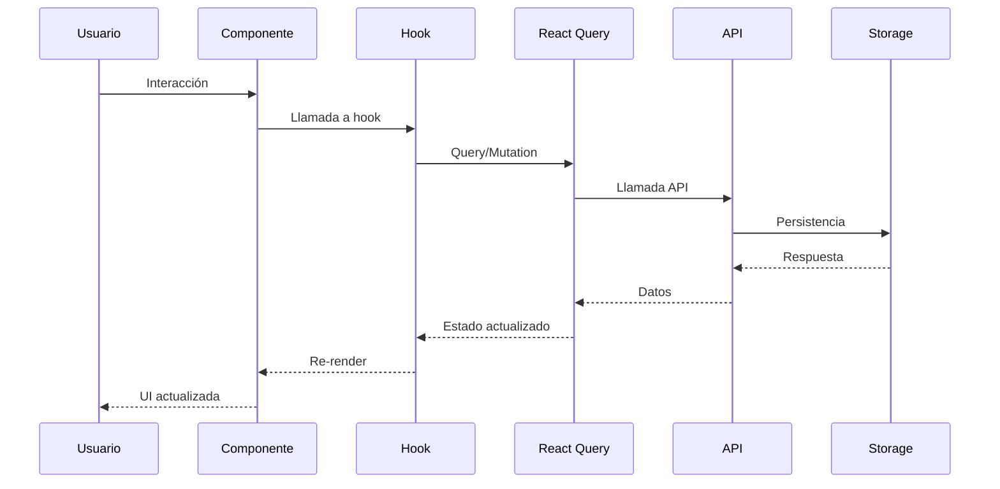

# 🏗️ Arquitectura Técnica - SOLUTION TECH

## 📋 Índice

- [🎯 Visión General](#-visión-general)
- [🏛️ Patrones Arquitectónicos](#️-patrones-arquitectónicos)
- [🔧 Stack Tecnológico](#-stack-tecnológico)
- [📊 Flujo de Datos](#-flujo-de-datos)
- [🎨 Patrones de Diseño](#-patrones-de-diseño)
- [🔒 Seguridad](#-seguridad)
- [⚡ Rendimiento](#-rendimiento)
- [🧪 Testing Strategy](#-testing-strategy)
- [📈 Escalabilidad](#-escalabilidad)

## 🎯 Visión General

SOLUTION TECH es una aplicación de chat empresarial construida con **Next.js 14** y **TypeScript**, siguiendo principios de arquitectura limpia y patrones de diseño modernos.

### 🎯 Objetivos Arquitectónicos

1. **Mantenibilidad**: Código limpio y bien estructurado
2. **Escalabilidad**: Fácil agregar nuevas funcionalidades
3. **Rendimiento**: Carga rápida y experiencia fluida
4. **Testabilidad**: Componentes y lógica fácilmente testables
5. **Reutilización**: Componentes y hooks reutilizables

## 🏛️ Patrones Arquitectónicos

### 📐 Arquitectura en Capas

```
┌─────────────────────────────────────────────────────────────┐
│                    Presentation Layer                       │
│  ┌─────────────┐  ┌─────────────┐  ┌─────────────┐        │
│  │   Pages     │  │ Components  │  │     UI      │        │
│  └─────────────┘  └─────────────┘  └─────────────┘        │
└─────────────────────────────────────────────────────────────┘
┌─────────────────────────────────────────────────────────────┐
│                    Business Logic Layer                     │
│  ┌─────────────┐  ┌─────────────┐  ┌─────────────┐        │
│  │    Hooks    │  │  Contexts   │  │   Utils     │        │
│  └─────────────┘  └─────────────┘  └─────────────┘        │
└─────────────────────────────────────────────────────────────┘
┌─────────────────────────────────────────────────────────────┐
│                      Data Layer                             │
│  ┌─────────────┐  ┌─────────────┐  ┌─────────────┐        │
│  │     API     │  │   Storage   │  │ Validation  │        │
│  └─────────────┘  └─────────────┘  └─────────────┘        │
└─────────────────────────────────────────────────────────────┘
```

### 🎯 Principios SOLID

#### 1. **Single Responsibility Principle (SRP)**
```typescript
// ✅ Correcto: Cada componente tiene una responsabilidad
export function MessageList({ messages }: MessageListProps) {
  return <div>{/* Solo renderiza mensajes */}</div>;
}

export function MessageInput({ onSend }: MessageInputProps) {
  return <input />; // Solo maneja input
}
```

#### 2. **Open/Closed Principle (OCP)**
```typescript
// ✅ Extensible sin modificar código existente
interface MessageRenderer {
  render(message: Message): React.ReactNode;
}

class TextMessageRenderer implements MessageRenderer {
  render(message: TextMessage) { /* ... */ }
}

class FileMessageRenderer implements MessageRenderer {
  render(message: FileMessage) { /* ... */ }
}
```

#### 3. **Liskov Substitution Principle (LSP)**
```typescript
// ✅ Los subtipos son intercambiables
interface StorageProvider {
  save(key: string, data: any): void;
  get(key: string): any;
}

class LocalStorageProvider implements StorageProvider {
  save(key: string, data: any) { /* ... */ }
  get(key: string) { /* ... */ }
}

class SessionStorageProvider implements StorageProvider {
  save(key: string, data: any) { /* ... */ }
  get(key: string) { /* ... */ }
}
```

#### 4. **Interface Segregation Principle (ISP)**
```typescript
// ✅ Interfaces específicas en lugar de una grande
interface ChatOperations {
  sendMessage(message: string): Promise<void>;
  deleteMessage(id: string): Promise<void>;
}

interface ChatQueries {
  getMessages(): Promise<Message[]>;
  searchMessages(query: string): Promise<Message[]>;
}
```

#### 5. **Dependency Inversion Principle (DIP)**
```typescript
// ✅ Depende de abstracciones, no de implementaciones
interface ChatService {
  sendMessage(message: string): Promise<void>;
}

export function useChat(service: ChatService) {
  // Usa la abstracción, no la implementación concreta
}
```

## 🔧 Stack Tecnológico

### 🎯 Frontend Framework
- **Next.js 14**: Framework React con App Router
- **TypeScript 5.0**: Tipado estático completo
- **React 18**: Hooks y características modernas

### 🎨 Styling & UI
- **Tailwind CSS 3.3**: Framework CSS utility-first
- **ShadCN/UI**: Componentes base reutilizables
- **Lucide React**: Iconografía consistente

### 📊 State Management
- **React Query 5.0**: Gestión de estado del servidor
- **React Context**: Estado global de la aplicación
- **Local Storage**: Persistencia de datos

### 🛠️ Development Tools
- **MSW 2.0**: Mocking de API para desarrollo
- **ESLint**: Linting de código
- **Prettier**: Formateo de código

### 📦 Build & Deployment
- **Vite**: Bundling rápido
- **Docker**: Containerización
- **Vercel**: Despliegue automático

## 📊 Flujo de Datos

### 🔄 Flujo Principal



### 🎯 Gestión de Estado

```typescript
// 1. Estado Local (useState)
const [localState, setLocalState] = useState();

// 2. Estado Compartido (Context)
const { globalState, updateGlobalState } = useAppContext();

// 3. Estado del Servidor (React Query)
const { data, isLoading, error } = useQuery({
  queryKey: ['chat', chatId],
  queryFn: () => fetchChat(chatId)
});
```

## 🎨 Patrones de Diseño

### 🏗️ Component Pattern

```typescript
// Componente Presentacional
interface MessageProps {
  message: Message;
  onDelete?: (id: string) => void;
}

export function Message({ message, onDelete }: MessageProps) {
  return (
    <div className="message">
      <p>{message.content}</p>
      {onDelete && (
        <button onClick={() => onDelete(message.id)}>
          Eliminar
        </button>
      )}
    </div>
  );
}
```

### 🎣 Custom Hook Pattern

```typescript
// Hook personalizado para lógica reutilizable
export function useChat(chatId: string) {
  const [messages, setMessages] = useState<Message[]>([]);
  const [isLoading, setIsLoading] = useState(false);

  const sendMessage = useCallback(async (content: string) => {
    setIsLoading(true);
    try {
      const newMessage = await api.sendMessage(chatId, content);
      setMessages(prev => [...prev, newMessage]);
    } catch (error) {
      console.error('Error sending message:', error);
    } finally {
      setIsLoading(false);
    }
  }, [chatId]);

  return { messages, isLoading, sendMessage };
}
```

### 🎭 Render Props Pattern

```typescript
// Componente con render props para flexibilidad
interface DataFetcherProps<T> {
  queryKey: string[];
  queryFn: () => Promise<T>;
  children: (data: T, isLoading: boolean, error: Error | null) => React.ReactNode;
}

export function DataFetcher<T>({ queryKey, queryFn, children }: DataFetcherProps<T>) {
  const { data, isLoading, error } = useQuery({ queryKey, queryFn });
  return <>{children(data, isLoading, error)}</>;
}
```

### 🏭 Factory Pattern

```typescript
// Factory para crear diferentes tipos de mensajes
class MessageFactory {
  static create(type: MessageType, content: any): Message {
    switch (type) {
      case 'text':
        return new TextMessage(content);
      case 'file':
        return new FileMessage(content);
      case 'image':
        return new ImageMessage(content);
      default:
        throw new Error(`Unknown message type: ${type}`);
    }
  }
}
```

## 🔒 Seguridad

### 🛡️ Principios de Seguridad

1. **Validación de Entrada**
   ```typescript
   // Validación con Zod
   const messageSchema = z.object({
     content: z.string().min(1).max(1000),
     type: z.enum(['text', 'file', 'image'])
   });
   ```

2. **Sanitización de Datos**
   ```typescript
   // Sanitizar contenido HTML
   import DOMPurify from 'dompurify';
   
   const sanitizedContent = DOMPurify.sanitize(userInput);
   ```

3. **Autenticación y Autorización**
   ```typescript
   // Middleware de autenticación
   export function withAuth(Component: React.ComponentType) {
     return function AuthenticatedComponent(props: any) {
       const { isAuthenticated } = useAuth();
       
       if (!isAuthenticated) {
         return <LoginPage />;
       }
       
       return <Component {...props} />;
     };
   }
   ```

### 🔐 Protección de Datos

- **Local Storage**: Solo datos no sensibles
- **HTTPS**: En producción
- **CORS**: Configuración apropiada
- **Rate Limiting**: Protección contra spam

## ⚡ Rendimiento

### 🚀 Optimizaciones

1. **Code Splitting**
   ```typescript
   // Lazy loading de componentes
   const ChatInterface = lazy(() => import('./ChatInterface'));
   ```

2. **Memoización**
   ```typescript
   // Memoizar componentes costosos
   const ExpensiveComponent = memo(({ data }) => {
     return <div>{/* Renderizado costoso */}</div>;
   });
   ```

3. **Virtualización**
   ```typescript
   // Para listas largas
   import { FixedSizeList as List } from 'react-window';
   ```

4. **Caching**
   ```typescript
   // Configuración de React Query
   const queryClient = new QueryClient({
     defaultOptions: {
       queries: {
         staleTime: 5 * 60 * 1000, // 5 minutos
         cacheTime: 10 * 60 * 1000, // 10 minutos
       },
     },
   });
   ```

### 📊 Métricas de Rendimiento

- **First Contentful Paint (FCP)**: < 1.5s
- **Largest Contentful Paint (LCP)**: < 2.5s
- **Cumulative Layout Shift (CLS)**: < 0.1
- **First Input Delay (FID)**: < 100ms

## 🧪 Testing Strategy

### 🎯 Pirámide de Testing

```
        /\
       /  \     E2E Tests (Pocos)
      /____\    
     /      \   Integration Tests (Algunos)
    /________\  
   /          \ Unit Tests (Muchos)
  /____________\
```

### 🧪 Tipos de Tests

1. **Unit Tests**
   ```typescript
   describe('MessageUtils', () => {
     it('should format message correctly', () => {
       const message = { content: 'Hello', timestamp: new Date() };
       const formatted = formatMessage(message);
       expect(formatted).toMatch(/Hello/);
     });
   });
   ```

2. **Integration Tests**
   ```typescript
   describe('ChatFlow', () => {
     it('should send and display message', async () => {
       render(<ChatInterface />);
       
       const input = screen.getByPlaceholderText('Type a message');
       fireEvent.change(input, { target: { value: 'Hello' } });
       fireEvent.click(screen.getByText('Send'));
       
       await waitFor(() => {
         expect(screen.getByText('Hello')).toBeInTheDocument();
       });
     });
   });
   ```

3. **E2E Tests**
   ```typescript
   describe('Chat Application', () => {
     it('should complete full chat flow', () => {
       cy.visit('/');
       cy.get('[data-testid="new-chat"]').click();
       cy.get('[data-testid="message-input"]').type('Hello');
       cy.get('[data-testid="send-button"]').click();
       cy.get('[data-testid="message-list"]').should('contain', 'Hello');
     });
   });
   ```

## 📈 Escalabilidad

### 🏗️ Arquitectura Escalable

1. **Microservicios Ready**
   ```typescript
   // Configuración de servicios
   const services = {
     chat: process.env.CHAT_SERVICE_URL,
     auth: process.env.AUTH_SERVICE_URL,
     files: process.env.FILES_SERVICE_URL,
   };
   ```

2. **Modular Design**
   ```typescript
   // Módulos independientes
   /src
   ├── modules/
   │   ├── chat/
   │   ├── auth/
   │   ├── files/
   │   └── notifications/
   ```

3. **Plugin Architecture**
   ```typescript
   // Sistema de plugins
   interface Plugin {
     name: string;
     initialize(): void;
     destroy(): void;
   }
   
   class PluginManager {
     private plugins: Map<string, Plugin> = new Map();
     
     register(plugin: Plugin) {
       this.plugins.set(plugin.name, plugin);
       plugin.initialize();
     }
   }
   ```

### 🔄 Estrategias de Escalabilidad

1. **Horizontal Scaling**: Múltiples instancias
2. **Vertical Scaling**: Más recursos por instancia
3. **Database Scaling**: Read replicas, sharding
4. **CDN**: Distribución de contenido estático
5. **Caching**: Redis, Memcached

---

## 📚 Referencias

- [Next.js Documentation](https://nextjs.org/docs)
- [React Query Documentation](https://tanstack.com/query)
- [TypeScript Handbook](https://www.typescriptlang.org/docs/)
- [Clean Architecture by Robert C. Martin](https://blog.cleancoder.com/uncle-bob/2012/08/13/the-clean-architecture.html)
- [SOLID Principles](https://en.wikipedia.org/wiki/SOLID)

